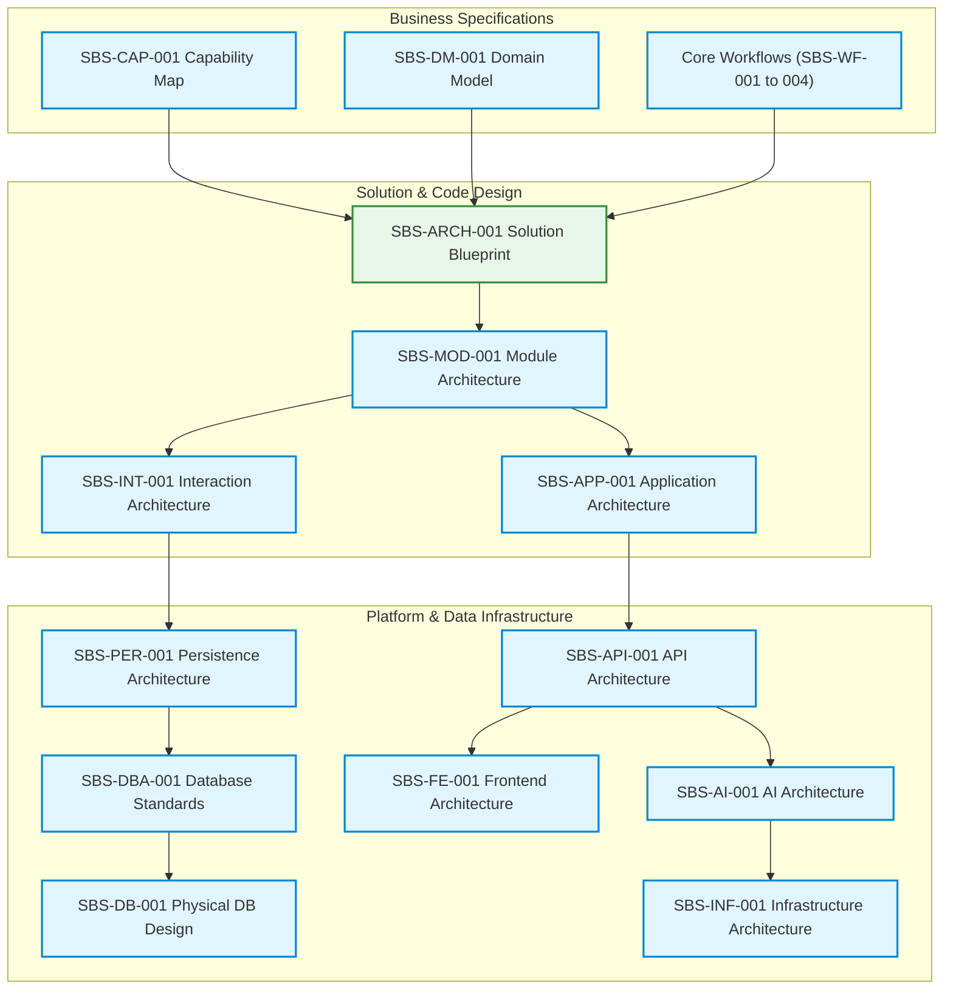

# SBS-ARCH-OVERVIEW-001 — Enterprise Architecture Overview

**Version:** Draft v0.2  
**Status:** 🔵 In Review  
**Owner:** Enterprise Architecture  
**Priority:** Foundational  

---

## 1. Purpose & Core Vision

This document serves as the primary entry point to the **SmartBooks Enterprise Architecture**. It provides a unified view of the platform's architectural layers, summarizes our core design principles, maps the complete document hierarchy, and details the reading roadmap for onboarding new contributors.

SmartBooks is built as an AI-assisted, multi-tenant B2B SaaS ERP platform tailored for small-to-medium retail and distribution businesses.

---

## 2. Document Hierarchy & Dependencies

The following dependency diagram illustrates how the architectural specifications build upon each other. Blueprints flow from business specifications down to physical engineering and hosting specifications.

---

## 3. Approved Architecture Specifications Index

Below is the authoritative registry of all approved architecture documents, including their exact file location links:

### A. Business Blueprints
* **Domain Model Spec [v1.0]**: Defines ubiquitous language and aggregates.  
  * [SBS-DM-001_Domain_Model.md](file:///C:/Users/Chandan%20Mishra/Documents/Antigravity/SmartBooks/docs/product/SBS-DM-001_Domain_Model.md)
* **Purchase Workflow Spec [v1.0]**: Procurement and tax ingestion.  
  * [SBS-WF-001_Purchase_Workflow.md](file:///C:/Users/Chandan%20Mishra/Documents/Antigravity/SmartBooks/docs/workflows/SBS-WF-001_Purchase_Workflow.md)
* **Sales Workflow Spec [v1.0]**: POS billing and split payments.  
  * [SBS-WF-002_Sales_Workflow.md](file:///C:/Users/Chandan%20Mishra/Documents/Antigravity/SmartBooks/docs/workflows/SBS-WF-002_Sales_Workflow.md)
* **Inventory Workflow Spec [v1.0]**: Stock reservation and WAC valuation.  
  * [SBS-WF-003_Inventory_Workflow.md](file:///C:/Users/Chandan%20Mishra/Documents/Antigravity/SmartBooks/docs/workflows/SBS-WF-003_Inventory_Workflow.md)
* **Payments Workflow Spec [v1.0]**: Inbound cash allocation and Contra entries.  
  * [SBS-WF-004_Payments_Workflow.md](file:///C:/Users/Chandan%20Mishra/Documents/Antigravity/SmartBooks/docs/workflows/SBS-WF-004_Payments_Workflow.md)
* **Accounting Domain Spec [v1.0]**: General Ledger event-driven posting rules.  
  * [SBS-AC-001_Accounting_Domain.md](file:///C:/Users/Chandan%20Mishra/Documents/Antigravity/SmartBooks/docs/product/SBS-AC-001_Accounting_Domain.md)
* **Business Capability Map [v1.0]**: Mapping UI layouts and SaaS profiles.  
  * [SBS-CAP-001_Capability_Map.md](file:///C:/Users/Chandan%20Mishra/Documents/Antigravity/SmartBooks/docs/product/SBS-CAP-001_Capability_Map.md)

### B. Solution & Infrastructure Blueprints
* **Solution Blueprint Spec [v1.0]**: Core architecture rules.  
  * [SBS-ARCH-001_Solution_Blueprint.md](file:///C:/Users/Chandan%20Mishra/Documents/Antigravity/SmartBooks/docs/architecture/SBS-ARCH-001_Solution_Blueprint.md)
* **Module Architecture Spec [v1.0]**: Directory structure and Clean layers.  
  * [SBS-MOD-001_Module_Architecture.md](file:///C:/Users/Chandan%20Mishra/Documents/Antigravity/SmartBooks/docs/architecture/SBS-MOD-001_Module_Architecture.md)
* **Interaction Architecture Spec [v1.0]**: Sagas, tracing, and idempotency.  
  * [SBS-INT-001_Interaction_Architecture.md](file:///C:/Users/Chandan%20Mishra/Documents/Antigravity/SmartBooks/docs/architecture/SBS-INT-001_Interaction_Architecture.md)
* **Persistence Architecture Spec [v1.0]**: Schema segregation and CQRS.  
  * [SBS-PER-001_Persistence_Architecture.md](file:///C:/Users/Chandan%20Mishra/Documents/Antigravity/SmartBooks/docs/architecture/SBS-PER-001_Persistence_Architecture.md)
* **Database Design Standards [v1.0]**: Naming conventions and UUID v7.  
  * [SBS-DBA-001_Database_Design_Standards.md](file:///C:/Users/Chandan%20Mishra/Documents/Antigravity/SmartBooks/docs/engineering/SBS-DBA-001_Database_Design_Standards.md)
* **Physical Database Design [v1.0]**: Outbox tables and indices.  
  * [SBS-DB-001_Physical_Database_Design.md](file:///C:/Users/Chandan%20Mishra/Documents/Antigravity/SmartBooks/docs/database/SBS-DB-001_Physical_Database_Design.md)
* **Application Architecture Spec [v1.0]**: CQRS read-bypass and validation.  
  * [SBS-APP-001_Application_Architecture.md](file:///C:/Users/Chandan%20Mishra/Documents/Antigravity/SmartBooks/docs/architecture/SBS-APP-001_Application_Architecture.md)
* **Integration Architecture Spec [v1.0]**: Ports, adapters, and webhook buffering.  
  * [SBS-INTG-001_Integration_Architecture.md](file:///C:/Users/Chandan%20Mishra/Documents/architecture/SBS-INTG-001_Integration_Architecture.md)
* **API Architecture Spec [v1.0]**: Path versioning and RFC 7807 envelopes.  
  * [SBS-API-001_API_Architecture.md](file:///C:/Users/Chandan%20Mishra/Documents/Antigravity/SmartBooks/docs/architecture/SBS-API-001_API_Architecture.md)
* **Frontend Architecture Spec [v1.0]**: Folder boundaries, client POS cache.  
  * [SBS-FE-001_Frontend_Architecture.md](file:///C:/Users/Chandan%20Mishra/Documents/Antigravity/SmartBooks/docs/architecture/SBS-FE-001_Frontend_Architecture.md)
* **AI Services Architecture Spec [v1.0]**: Structured outputs and token limits.  
  * [SBS-AI-001_AI_Services_Architecture.md](file:///C:/Users/Chandan%20Mishra/Documents/Antigravity/SmartBooks/docs/architecture/SBS-AI-001_AI_Services_Architecture.md)
* **Infrastructure Architecture Spec [v1.0]**: Twelve-factor processes, log streams.  
  * [SBS-INF-001_Infrastructure_Architecture.md](file:///C:/Users/Chandan%20Mishra/Documents/Antigravity/SmartBooks/docs/architecture/SBS-INF-001_Infrastructure_Architecture.md)

---

## 4. Strategic Architectural Invariants (Non-Negotiable Rules)

Across all specification documents, developers must adhere to the following invariants:
1. **Clean Decoupling**: Business rules reside strictly in the Domain layer. Application, API, database, and UI layouts are dependencies that point inward.
2. **Schema-Level Data Ownership**: Direct tables accesses or joins across domain schemas are banned. Cross-domain consistency uses transactional outboxes and domain events.
3. **Audit Immutability**: Posted documents (sales/purchase invoices, ledger journals, stock movements, payments) are immutable. Corrections must be handled by publishing new reversing transactions.
4. **AI Advisory Role**: AI output is untrusted data. It always parses to a draft status (e.g. `PENDING_REVIEW`) and must be validated by business logic and approved by a user before mutating ledger records.
5. **Traceability Correlation**: Every workflow execution, event propagation, and background job must carry a unified `correlationId` to trace logs end-to-end.
